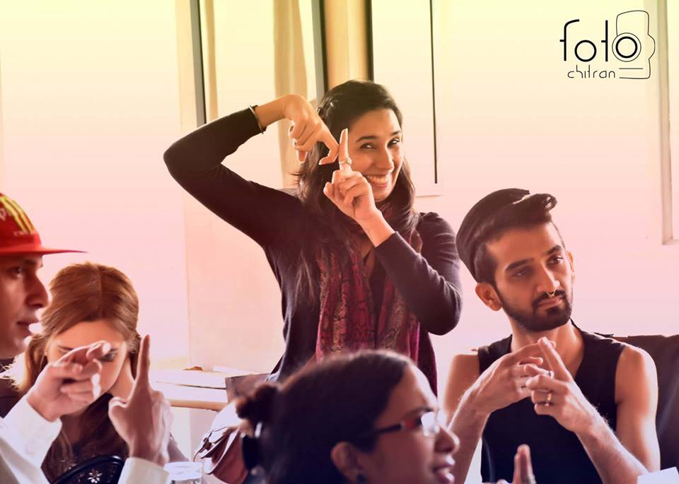

> If you are a resident of Delhi then there are many possibilities that you heard about the “Hearken cafe”.

> If you never heard about it then you think what’s special about the cafe and why I am talking about it? Just hold on guys I’ll give you all the answers to your questions that you have in your mind.

> So first talk about what’s so special in the cafe that makes him different from the other cafes. The thing that makes the cafe special is their staff. The employees in the cafe are hearing impaired( persons who are partially or completely deaf) peoples. Yeah, if you go to the cafe all the staff are the people who are hearing impaired.

> But now you wonder how the hearing impaired peoples are able to understand what the customer is actually asking for?

> You don’t have to worry for this because they are specially skilled persons who know the sign language very well.

> Now I thought the things are pretty much clear why I am actually talking about the cafe.

> But a question still remains unanswered. Where did the word “Hearken” came from? For this, you have to ask this questions to their owners. So now let’s talk to owners.

> The owners of the cafe are Smriti Nagpal and Virat Suneja. The idea of opening a café and employing hearing impaired people wasn’t a decision that needed much thought. Virat had grown up with his cousins, Kapil and Mamta who are hearing impaired.

> Virat said that he and Smriti had the idea of opening a cafe, that run by the hearing impaired people has came on one night at the dining table.  
> Smriti is working as a sign language expert and working with the DD news as a sign language interpreter for over a decade. Their cousins chose the name Hearken, which means “to hear” in Old English

> Now the cafe has been in existence for six months and gained the popularity in all over the Delhi because of their special staff.  
> While talking to Virat he said,”In the beginning, it is very tough decision to assign them their works. But now with the practice, they are now well-versed with all the things to run the cafe.”

> Now the duo is also working to ensure that the sign language is being familiar to everyone.

> They encourage people to come in their cafe and learn the sign language. The cafe conducts sign language classes every Tuesday between 5:00 pm to 6:00 pm.   
> They wanted to break the stereotypes that our society has in their minds. They think that apart from hearing impaired there is no difference in them.

> A report published by the World Health Organisation states that 360 million people in the world suffer from hearing loss.

> I actually support their efforts that how they are working for those peoples. We wish the duo all the best for their works.